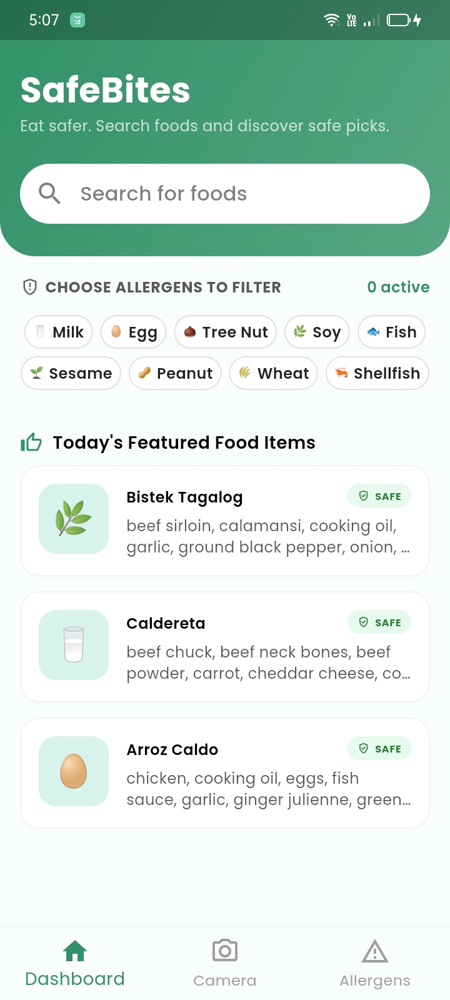
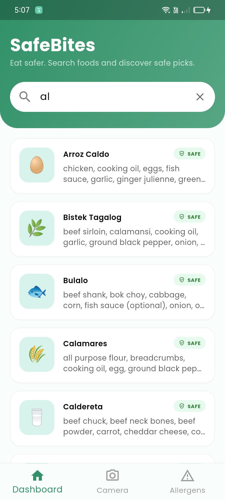
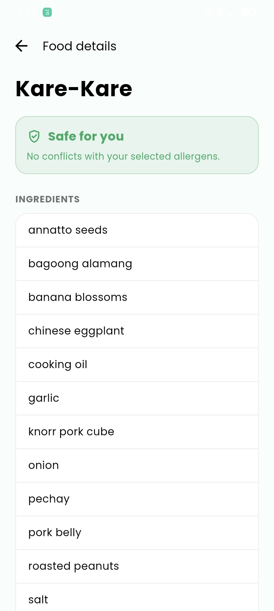
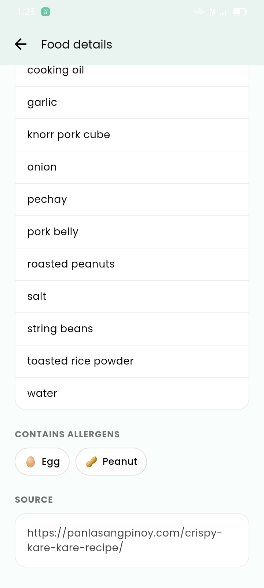
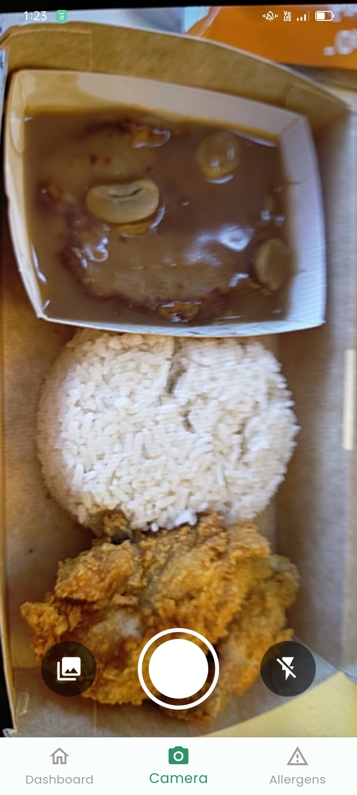
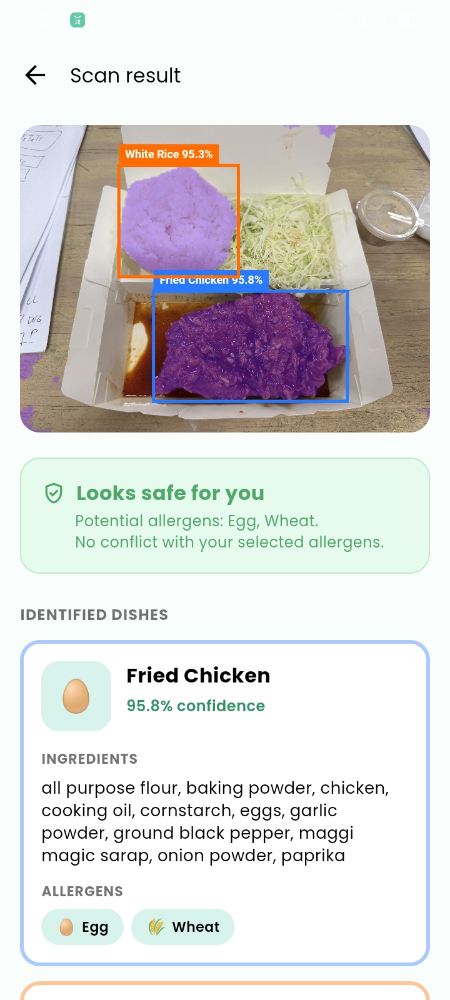
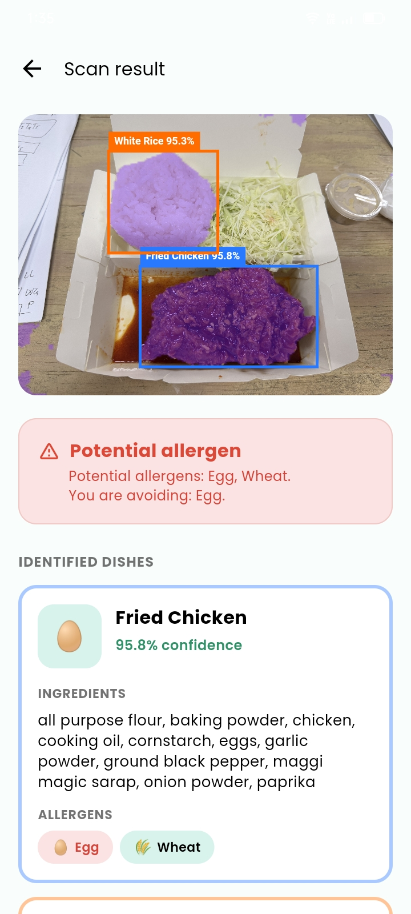
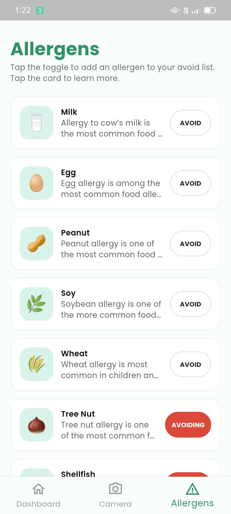
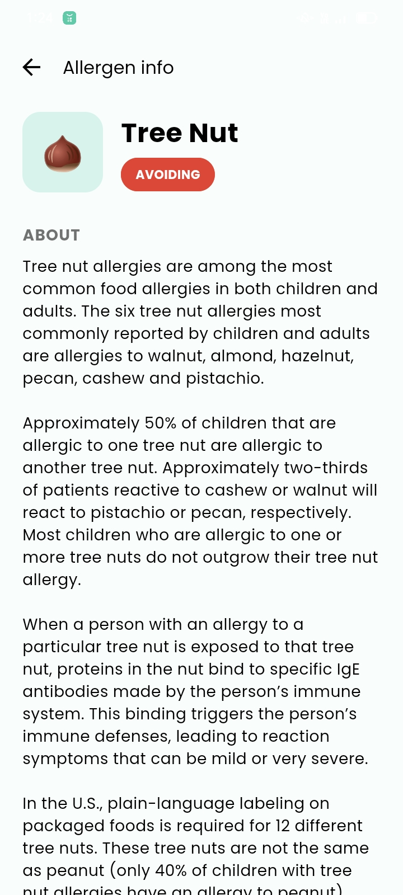
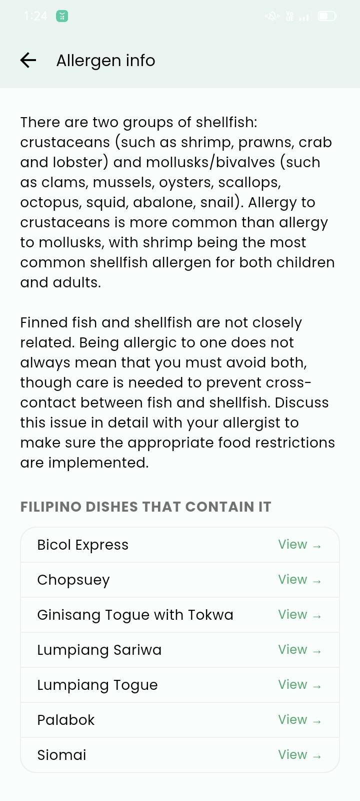

# SafeBites

SafeBites is an Android mobile application that helps users identify Filipino food items and check for potential allergens. The app uses image recognition to detect food from captured or uploaded images, then cross-references the detected food with a locally stored database to display ingredients and allergen information. This project is for academic and research purposes.

## Features

<ul>
  <li>Capture food images using the camera
  <li>Upload food images from gallery
  <li>Filipino food recognition using YOLOv11s
  <li>Allergen detection based on ingredients
  <li>Search food items manually
  <li>Offline image recognition and database access
  <li>Featured foods section
  <li>Custom avoided allergens filter
</ul>

## Screenshots

### Splash Screen and Dashboard

<p align="left"> 
 </p>

### Search and Food Info

<p align="left"> 

 </p>

### Camera and Results Screens

<p align="left"> 

 </p>

### Allergens and Allergen Info

<p align="left"> 

 </p>

## Tech Stack

<ul>
  <li>Flutter
  <li>Dart
  <li>SQLite
  <li>TensorFlow Lite (TFLite)
  <li>Ultralytics YOLOv11s
</ul>

## How It Works

<ol>
  <li>The user captures or uploads an image.
  <li>The YOLOv11s model detects Filipino food items in the image.
  <li>The app retrieves ingredient and allergen data from a local SQLite database.
  <li>The app warns users if detected foods contain avoided allergens.
</ol>

## Limitations

<ul>
  <li>Supports only selected Filipino food items
  <li>Works best with clear and well-lit images
  <li>Allergen information depends on the locally stored database
</ul>

## Installation

1. Clone the repository

```bash
git clone https://github.com/cslabiano/SafeBites.git
```

2. Navigate to the project folder

```bash
cd safebite
```

3. Install dependencies

```bash
flutter pub get
```

4. Run the app

```bash
flutter run
```
